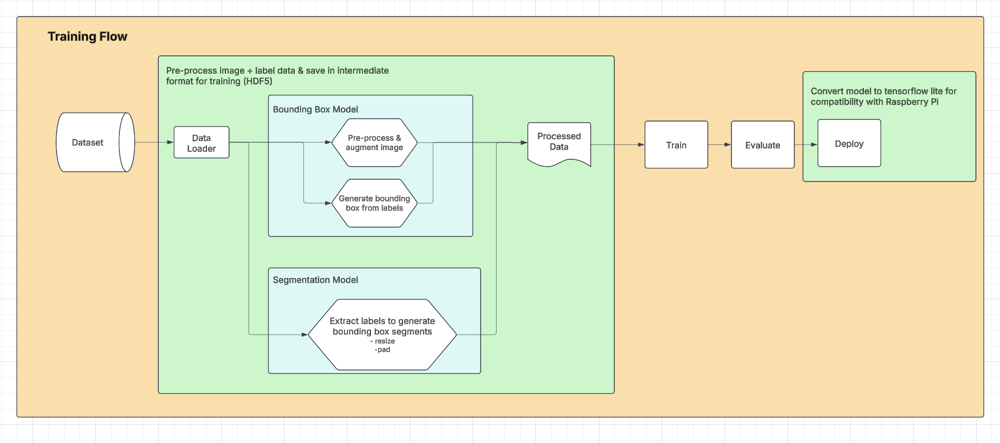
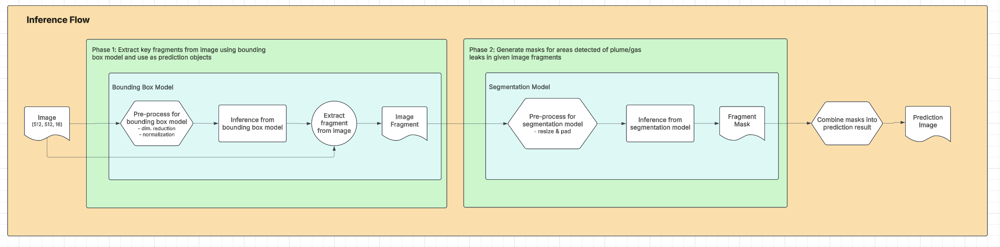

# SatML

## Overview
This project aims to develop an AI model for methane plume detection in hyper-spectral satellite images.

- [Project Plan](https://docs.google.com/presentation/d/1-EhQxIQwFT2OGoom4cRer84D6BYW3aajtIMfXAEZegI/edit#slide=id.g3106297605c_0_580)
- [Related Research](https://www.researchgate.net/publication/375797680_STARCOP_Semantic_Segmentation_of_Methane_Plumes_with_Hyperspectral_Machine_Learning_Models)

## Setup
Use Python 3.11 for the current requirements.
- Clone the repo and navigate to the SatML directory
- Create virtual environment:
  - On Linux: `python3.11 -m venv venv`
  - On Windows: `py -3.11 -m venv venv`
- Activate the virtual environment and set up requirements
  - On Linux: `source venv/bin/activate`
  - On Windows: `venv/scripts/activate`
- Update pip and install requirements
  ```
  pip install --upgrade pip
  pip install -r requirements.txt
  ```

## System Architecture



## Contributors
- [Prahar Ijner](https://github.com/pijner) [TPM]
- [Sarah Ali](https://github.com/sarahmakki12) [TPM]
- [Harsh Patel](https://github.com/hpatel0816) [active core member]
- [Michelle Yao](https://github.com/michellejyao) [active core member]
- [Yasmeen Elkheir](https://github.com/yasmeene) [active core member]
- [Madeline Kim](https://github.com/madelineekim) [active core member]
- [Chloe Zheng](https://github.com/lilmonkey912) [active core member]
---
- [Kelvin Ying](https://github.com/KelvYing)
- [Calista Besseling](https://github.com/CalistaBesseling)
- [Cristian Moretto](https://github.com/criscreates)
---
